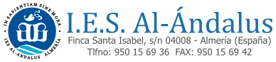

# Proyectos Integrados DAW-SP 2023-24

En este repositorio se encuentra centralizada toda la información relativa a los Proyectos de Desarrollo de Aplicaciones Web en modalidad semipresencial del IES Al-Ándalus (proyectos de fin de ciclo), en la convocatoria del año 2023.

## Requisitos y criterios a seguir

Tanto los criterios generales como los criterios particulares por cada módulo se encuentran en la [wiki del repositorio.](https://github.com/pialandalus/proyectos-daw-2023/wiki)

# Presentaciones Semipresencial DAW del curso 2023 / 2024

Horarios, índices a los repositorios de alumnos/as y normas para las presentaciones de alumnos/as de **2º DAW** (Desarrollo de Aplicaciones Multiplataforma)  del **IES Al-Ándalus** (Almería) del curso 2023 - 2024.

## Cuadrante horario de las presentaciones con índices a los repositorios

Cada alumno/a debe enlazar con el repositorio donde tiene su presentación.

### :calendar: Viernes 27 de mayo de 2022

##### 2ºDAW

* 12:00h [Apellidos, Alumno](Enlace a GitHub)
* 13:00h [Apellidos, Alumno](Enlace a GitHub)

## :stopwatch: Tiempo para la presentación

La defensa del proyecto es un acto formal que se puede realizar al final del primero, segundo o tercer trimestre. Esta defensa tendrá una duración de 45 minutos, dividida en 30 minutos para la exposición del proyecto y 15 minutos para preguntas/resolución de dudas.

Se deberá enseñar una demostración práctica (demo) de la aplicación web en funcionamiento.

## :open_file_folder: Contenido de la presentación

La presentación debe tener, como mínimo, el siguiente contenido:

* Introducción a la empresa. Se debe hacer en común cuando en la misma empresa hay varios alumnos.
* Tareas desempeñadas con temporalización por semanas.
* Herramientas utilizadas.
* Conocimientos adquiridos por cada módulo profesional.
* Valoración de la experiencia dual por parte del alumno.

## :bookmark_tabs: Formato de la presentación
La presentación debe seguir las pautas explicadas en la [wiki](https://github.com/pialandalus/proyectos-daw-2023/wiki) de este repositorio.

Se puede utilizar cualquier herramienta para elaborar la presentación. El alumno se puede apoyar en material multimedia si lo considera oportuno.

Independientemente de la herramienta utilizada para crear y mostrar la presentación, debe haber una versión en pdf en el repositorio de GitHub.

Cualquier material utilizado en la presentación debe estar disponible desde el repositorio de GitHub: presentación original, presentación en formato pdf, enlaces a videos, etc.

## :school: Lugar de la presentación

Las presentaciones SON PRESENCIALES y tendrán lugar en el **Aula Ateca** situada en el IES Al-Ándalus.

## 🖥️ Repositorio de proyectos

  
| Alumno/a | Título | Memoria | Exposición | Repositorio | Demo |
| ------------- | ------------- | ------------- | ------------- | ------------- | ------------- |
| Alumno Alumno  | Titulo  |   |   |   |   |

